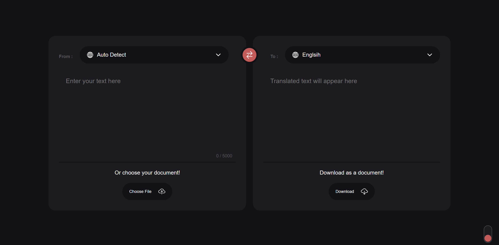

# Translation App UI

This is a simple translation app UI built using HTML, CSS, and JavaScript. It allows users to translate text between different languages and provides a user-friendly interface for interacting with translation services.

## Features

- Translate text between multiple languages.
- User-friendly interface with intuitive design.
- Easy to use and understand.
- Responsive layout for mobile and desktop devices.

## Technologies Used

- HTML
- CSS
- JavaScript
